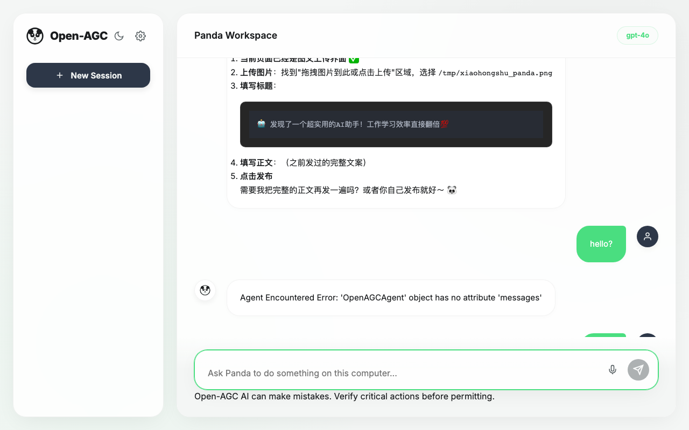

# Open-AGC (Agentic Computer Control)

 


Open-AGC 是一款基于本地电脑操作环境构建的全能型智能体框架。该项目提供能够自主规划、思考并执行终端命令、文件系统操作、临时 Python 计算脚本以及直接控制键鼠的 AI 助手。不仅包含了强大易用的抽象核心代码，还配有极具现代感的炫酷网页交互界面。

*Read this in other languages: [English](README_en.md)*

## 🌟 核心特性 (Features)

- **多模型即插即用 (Plug & Play LLMs)**: 基于 `litellm` 支持 OpenAI, Anthropic, Gemini, DeepSeek 或本地部署模型（Ollama / vLLM）。Web 界面提供一键切换与配置功能。
- **物理设备控制 (PyAutoGUI)**: 支持让 Agent 取代您接管鼠标和键盘，点击特定屏幕像素与输入快捷键。
- **现代化 Web 界面**: 全新打造的 **Panda Theme（熊猫流光主题）**，融入竹青色系与圆润极简设计，支持动态工具状态气泡悬浮推送，科技感与温润感并存。
- **国际化 (i18n) 与本地化**: 前端界面深度支持自动检测浏览器语言进行中英双语无缝切换。
- **智能记忆系统 (Smart Memory Engine)**: 
  - 搭载 **SQLite FTS5 全文检索引擎**，让大模型实现真正的持久跨会话记忆感知。
  - **静默后台摘要 (Zero-shot Auto-Retrieve)**：大模型会在对话间隙自动判定历史记录的价值，并将其萃取为核心偏好或长期知识，在您下次开场打招呼时秒回相关上下文。
- **技能树系统 (Skills System)**:
  - Agent 可以**自主思考**并为您编写针对高频任务的 Markdown 定制 SOP 模板 (`skills/` 目录)。
  - 当加载不同技能库时，即使面对极其复杂的交叉环境操作，Agent 也能从容应对。
- **智能体防失控护盾 (Agent Safeguards)**:
  - 独创 **Tool Loop Detection (死循环检测)**，自动识别大模型“死磕”无效代码的错误倾向，并在连续出错时强行打断注入新思路。
  - 柔性的上下文动态压缩机制与全局回合数硬保险（Max Iterations），彻底防范高昂的意外 Token 账单。

---

### 1. 克隆并进入目录
```bash
git clone https://github.com/deanwinchester/open-agc.git
cd open-agc
```

### 2. 快速运行
我们提供了自动化的全能脚本，会自动处理环境搭建、依赖安装并开启服务：

- **macOS / Linux**: 运行 `./start.sh`
- **Windows**: 双击运行 `start.bat`

### 3. 图形化配置 API Key
启动后，直接在浏览器界面的 **Settings (设置)** -> **系统配置** 中动态填写您的 API Key 并保存。您无需手动编辑任何配置文件。

---

Open-AGC 提供了便捷的脚本入口：

- **开发调试**: 运行上述 `./start.sh` 或 `start.bat` 即可进入 Web 交互界面。
- **打包分发**:
  - Mac 用户运行 `./build_mac.sh` 生成 `.dmg` 安装包。
  - Windows 用户运行 `build_win.bat` 生成便携版压缩包。

---

## ⚠️ 安全警告 (Security Caveats)
- **不可逆的命令权限**：该智能体会**真实地**在您的宿主机环境中执行终端 `bash` 指令和 Python 代码，包含删除文件等的最高权限！请不要赋予它修改敏感数据的命令或者切勿在生产环境中无看护运行。
- **硬件控制防呆机制**：物理操控模式下（`computer_control`工具），如果它的鼠标走向了失控的死循环，请立刻**将实体鼠标滑向屏幕四角的任意一个顶角**，这会触发 PyAutoGUI 的 `FAILSAFE` 异常并强制中止其运行！
- **费用限制**：虽然内置了防止死循环和 Token 截断的优化逻辑，由于自动化工具的自主延展性，仍请定期检查由于调用商业大模型 API 产生的开销账单。

## 🤝 贡献 (Contributing)
欢迎提交 Pull Requests 来丰富 `tools/` 目录下的可用工具库或是贡献您编写的好用技能！
