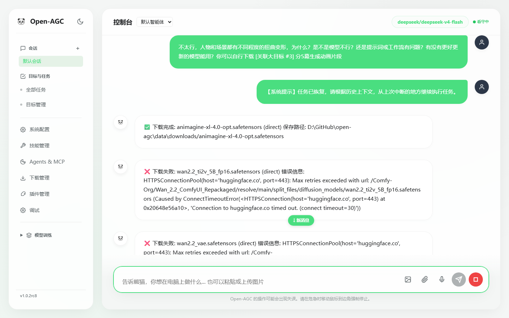

# 🐼 Open-AGC · 熊猫事务所

> **Open-AGC (Agency) — 熊猫事务所**，一款基于本地电脑操作环境构建的全能型 AI 智能体框架。


Open-AGC 能够自主规划、思考并执行终端命令、文件系统操作、Python 脚本、浏览器自动化以及键鼠控制。项目包含强大的抽象核心与极具现代感的 **Panda Theme（熊猫流光主题）** 网页交互界面。

*Read this in other languages: [English](README_en.md)*

## 📸 界面预览



**Vue3 SPA 界面**：左侧会话导航 + 中央聊天区 + 右侧进度面板，支持流式响应实时渲染、工具执行步骤展开/收起、分身状态可视、主题市场一键切换。设置页按功能拆分（模型/系统/主题/技能/MCP/插件/凭证库），移动端抽屉式导航自适应。

## 🌟 核心特性 (Features)

- **多模型即插即用 (Plug & Play LLMs)**: 基于 `litellm` 支持 OpenAI、Anthropic、Gemini、DeepSeek、Moonshot、小米 MiMo 等商业模型及 Ollama、vLLM、SGLang、llama.cpp 等本地部署方案。Web 界面提供一键切换、可视化配置与自定义厂商（OpenAI 兼容端点）扩展。
- **调度者（分身）模式 (Dispatcher Mode)**: 主 Agent 可将复杂任务拆解并派发给多个分身（Sub-Agent）并行执行，支持断点续传、状态持久化与失联检测，服务重启后自动恢复。
- **后台任务系统 (Background Task System)**: 支持定时/一次性任务调度，shell 命令超时自动后台化，服务重启后自动恢复未完成任务与孤儿进程管理。
- **物理设备控制 (PyAutoGUI)**: Agent 可直接操控鼠标键盘，触发 FAILSAFE 防呆机制（鼠标移至屏幕四角强制中止）。
- **浏览器自动化 (Playwright)**: 内置 Chromium 浏览器引擎，支持网页导航、表单填写、截图、JS 执行等完整浏览器操控能力。
- **现代化 Web 界面**: **Vue3 SPA + Panda Theme（熊猫流光主题）**，竹青色系 + 玻璃拟态面板，WebSocket 实时推送工具执行状态与流式响应。设置页按功能拆分（模型/系统/主题/技能/MCP/插件/凭证库），支持移动端自适应。
- **访问控制 (Access Control)**: 本机访问免密直连，局域网设备需输入访问密码，公网（含 IPv6）一律拒绝，Docker 部署同样生效。
- **主题系统 (Theme System)**: 支持主题导出/导入、主题市场一键应用，自定义主色与侧边栏色。
- **国际化 (i18n)**: 自动检测浏览器语言，中英双语无缝切换。
- **智能记忆系统 (Smart Memory Engine)**:
  - **SQLite FTS5 全文检索** + BM25 排序，持久化跨会话记忆。
  - **向量语义记忆 (Vector Semantic Memory)**: 支持语义级记忆检索与距离阈值过滤。
  - **静默后台摘要 (Auto-Memory)**: 每轮对话后自动萃取关键事实存入记忆库，下次对话自动注入相关上下文。
- **对话历史检索 (Search History)**: 全量对话历史词级部分匹配搜索，支持检索 task_steps 数据库，上下文自动注入关键发现。
- **技能树系统 (Skills System)**: Agent 可自主编写 Markdown 格式 SOP 模板（`skills/` 目录），支持导入、验证与安全管理。内置技能安装器与语义混合检索，避免无关技能误加载。
- **工具信任评分 (Auto-Tool Graduation)**: 工具调用成功率自适应统计，自动毕业为可信工具，减少权限提示。
- **并行子代理 (Parallel Sub-Agent)**: 支持并行执行多个子代理任务，输出深度综合分析报告。
- **智能体防失控护盾 (Agent Safeguards)**:
  - **死循环检测 (Tool Loop Detection)**: 自动识别重复无效调用并在连续出错时强制注入新思路。
  - **上下文字段动态压缩**: 单次工具返回超 15K 字符自动截断。
  - **最大迭代次数硬保险 (Max Iterations)**: 可配置的全局回合数上限，防范意外 Token 账单。
  - **PID 自保护机制**: 自动记录服务进程 PID，拦截对服务本身及其父进程（VS Code Debugger）的误杀操作。
  - **tool_call JSON 自动修复**: LLM 返回格式不标准的 JSON 参数时自动修复并继续。
  - **异常自动恢复**: 未预期异常时自动重试一次，注入错误上下文让 Agent 换策略。
  - **谎报治理**: 分身执行状态实时可见，杜绝「确认还在跑」等无依据空谈。
- **MCP 协议支持 (MCP Tool)**: 支持 Model Context Protocol，可集成外部 MCP 工具服务。
- **Docker 部署**: 提供 `Dockerfile` 和 `docker-compose.yml`，一键容器化运行（含 xvfb 无头显示支持）。

---

## 🚀 快速开始

### 前置依赖

| 依赖 | 版本要求 | 说明 |
|------|----------|------|
| **Python** | ≥ 3.9 | 项目运行核心环境 |
| **Node.js** | ≥ 18 (可选) | 用于前端 Vite 构建（自带预构建产物时可跳过） |
| **npm** | ≥ 9 (可选) | 随 Node.js 一同安装 |

> 启动脚本（`start.sh` / `start.bat`）会自动检测并尝试通过系统包管理器（apt/brew/winget）安装缺失的 Python 及 Node.js。如果自动安装失败，请根据上方表格手动安装。

### 1. 克隆项目
```bash
git clone https://github.com/deanwinchester/open-agc.git
cd open-agc
```

### 2. 一键启动
自动化脚本会处理虚拟环境创建、Node.js 依赖安装（如需要）、前端 Vite 构建并启动服务：

- **macOS / Linux**: 运行 `./start.sh`
- **Windows**: 双击运行 `start.bat`

启动后访问 `http://localhost:8000`。

### 3. 配置 API Key
在 Web 界面的 **设置 → 模型与服务** 中填写 API Key 并保存，无需手动编辑配置文件。支持自定义厂商（OpenAI 兼容端点）与本地模型（llama.cpp）下载管理。也可通过 `.env` 文件设置环境变量（参考 `.env.example`）。

### 4. 命令行模式
```bash
# 交互式 REPL
python main.py

# 单次查询
python main.py "列出当前目录的文件"
```

---

## 🐳 Docker 部署

```bash
# 构建并启动
docker compose up -d

# 或单独构建
docker build -t open-agc .
docker run -d -p 8000:8000 -v ./data:/app/data -v ./workspace:/app/workspace open-agc
```

### 🔒 访问控制（本机免密 / 局域网密码 / 公网禁止）

内置 IP 分层访问控制：**本机访问免密直连**；**局域网设备需输入访问密码**；**公网（含公网 IPv6）一律拒绝**。

配置访问密码（二选一）：

```bash
# 方式一：环境变量播种（Docker 推荐）——config.json 未配置时把环境
# 变量写入 config.json（一次性），之后以 config.json 为准；已配置则忽略
docker run -d -p 8000:8000 \
  -e OPEN_AGC_ACCESS_PASSWORD=你的访问密码 \
  -v ./data:/app/data -v ./workspace:/app/workspace open-agc

# 方式二：docker-compose.yml 的 environment 节（compose 已带注释示例）
#   - OPEN_AGC_ACCESS_PASSWORD=你的访问密码

# 方式三：启动后在「设置 → 访问控制」页面配置/修改（保存到 data/config.json）
```

不设置密码时仅允许本机访问（最安全默认）。判断口径始终以 config.json 为唯一事实源。

**Docker 网络注意**：bridge 端口映射经 NAT，容器看到的源地址都是 docker 网关——宿主机访问同样需密码，且公网/局域网无法在应用层区分。**公网禁止须靠端口映射面保证**：compose 默认绑 `127.0.0.1:8000:8000`（仅宿主机）；局域网开放请绑定到具体 LAN 网卡（如 `192.168.x.x:8000:8000`），不要裸写 `8000:8000`（会暴露公网）。Linux 上也可用 `network_mode: host` 获得与裸机完全一致的语义。

---

## 🔌 插件系统 (Plugin System)

Open-AGC 支持即插即用的插件架构。插件存放在 `plugins/` 目录，服务启动时自动发现并加载，前端菜单动态渲染。

### 插件规范

每个插件是一个子目录，必须包含 `plugin.json` 清单文件和 `__init__.py` 入口：

```
plugins/<name>/
├── plugin.json          # 清单：name, version, menu, dependencies
├── __init__.py          # init_plugin(context) → PluginInstance
├── routes.py            # FastAPI APIRouter（可选）
├── static/              # 前端资源（可选）
│   ├── plugin.js        # 前端入口
│   └── plugin.css       # 样式
└── requirements.txt     # 插件依赖（可选）
```

`plugin.json` 示例：

```json
{
  "name": "my-plugin",
  "version": "1.0.0",
  "description": "插件描述",
  "menu": {
    "section": "my-section",
    "label": "菜单名称",
    "icon": "🔧",
    "views": [
      {"id": "view-id", "label": "视图名称"}
    ]
  }
}
```

### 内置插件：open-agc-train

模型训练、微调、PPL 评估与 Benchmark 测评功能作为独立插件存放于 `plugins/open-agc-train/`。

```bash
# 安装训练依赖（可选，默认跳过以加速主程序启动）
pip install -r plugins/open-agc-train/requirements.txt

# 数据迁移（如有旧版训练数据）
cd plugins/open-agc-train
python db.py migrate --from ../../data/chat_history.db --to ../../data/plugins/open-agc-train/training.db
```

---

## 🛠️ 工具矩阵 (Tools)

| 工具 | 功能 | 依赖 |
|------|------|------|
| `shell` | 执行终端命令 | subprocess |
| `python_repl` | 执行临时 Python 脚本 | subprocess |
| `filesystem` | 文件读写操作 | — |
| `browser` | 浏览器自动化（Chromium） | Playwright |
| `computer` | 键鼠物理控制 | PyAutoGUI |
| `web_search` | 网络搜索 | duckduckgo-search |
| `memory` | 记忆管理（增删查） | SQLite FTS5 |
| `search` | 对话历史全文搜索 | SQLite FTS5 |
| `download` | 文件下载管理（含断点续传） | — |
| `interaction` | 用户交互（询问/确认） | — |
| `auto_tool` | 工具信任评分与自动毕业 | — |
| `permissions` | 工具权限管理 | — |
| `sandbox` | 统一沙箱路径检查 | — |
| `mcp_tool` | MCP 协议外部工具集成 | — |
| `discovery` | 工具发现与自省 | — |
| `email_tool` | 邮件搜索与发送 | — |
| `save_skill` | 技能学习与持久化 | — |
| `system_mac` | macOS 系统级操作 | — |
| `dispatch_worker` | 调度者模式分身派发 | — |
| `message_worker` | 分身消息注入与状态同步 | — |
| `install_skill` | 技能安装与验证 | — |
| `theme_tool` | 主题导出/导入/市场应用 | — |
| `task_plan` | 任务目标与计划管理 | — |

---

## 🏗️ 项目结构

```
open-agc/
├── agent/              # Agent 核心循环、调度者（分身）模式与子代理编排
├── api/                # FastAPI 服务端（路由、WebSocket、访问控制）
├── core/               # 核心模块（LLM 客户端、记忆存储、插件管理、技能安装）
├── tools/              # 工具集（20+ 工具：shell/python/browser/computer/记忆/技能/主题等）
├── plugins/            # 插件目录（内置 open-agc-train 训练插件）
├── vue-app/            # Vue3 SPA 前端源码（Vite 构建）
│   └── src/
│       ├── views/      # 页面视图（聊天/任务/目标/下载/沙箱/调试/设置）
│       ├── components/ # 组件（聊天/进度卡片/表单等）
│       └── stores/     # Pinia 状态（WebSocket/主题）
├── static/             # 前端构建产物（Vue SPA 输出目录）
├── skills/             # Agent 技能库（Markdown SOP）
├── marketplace/        # 主题市场配置
├── data/               # 运行时数据（SQLite、配置、记忆库）
├── models/             # 本地模型文件（GGUF 等）
├── workspace/          # 沙箱工作目录
├── main.py             # CLI 入口
├── launcher.py         # PyInstaller 打包入口
├── gui_app.py          # 桌面 GUI 入口（pywebview）
├── start.sh / start.bat   # 一键启动脚本（自动安装依赖）
├── build_win.bat       # Windows 打包脚本
├── build_mac.sh        # macOS 打包脚本
├── build_deb.sh        # Linux/UOS deb 打包脚本
├── Dockerfile          # Docker 镜像
└── docker-compose.yml  # Docker Compose 编排
```

---

## 📦 打包分发

| 平台 | 脚本 | 输出 | 说明 |
|------|------|------|------|
| **Windows** | `build_win.bat` | `dist/*.zip` / NSIS 安装包 | 包含 Python 运行时，无需预装环境 |
| **macOS** | `./build_mac.sh` | `dist/*.dmg`（x86_64 / arm64 / universal） | 拖拽安装，支持 Apple Silicon |
| **Linux/UOS** | `./build_deb.sh` | `dist/*.deb`（amd64 / arm64） | 桌面快捷方式 + 命令行入口 |

> **架构选择**：x86_64（Intel/AMD）请下载 `Open-AGC-<VERSION>-Linux-amd64.deb`；UOS / 银河麒麟 / 鲲鹏 / 飞腾等 ARM64 设备请下载 `Open-AGC-<VERSION>-Linux-arm64.deb`。本地手动打包在目标架构机器上执行 `./build_deb.sh amd64` 或 `./build_deb.sh arm64`。
>
> **glibc 兼容**：Release CI 在 `manylinux_2_28`（glibc 2.28）容器内构建 Linux 二进制，可运行于 glibc ≥ 2.28 的系统（含 UOS / 银河麒麟）。本地用新系统（glibc 更高）直接 `./build_deb.sh` 打出的包**不兼容** glibc 2.28 目标机；如需本地兼容构建，请在 manylinux 容器内执行 PyInstaller，例如：
> `docker run --rm -v "$PWD":/src -w /src quay.io/pypa/manylinux_2_28_x86_64 bash -c "/opt/python/cp310-cp310/bin/python -m venv /tmp/v && source /tmp/v/bin/activate && pip install pyinstaller -r requirements.txt pywebview && pyinstaller open_agc.spec --clean --noconfirm --distpath dist/linux --workpath build/linux"`（arm64 换 `manylinux_2_28_aarch64`），再运行 `./build_deb.sh` 的组装部分。

推送 `release` 分支时，GitHub Actions 自动构建并发布全部平台安装包（Docker 镜像、Windows ZIP、macOS DMG、Linux amd64/arm64 deb）。

打包后的应用将用户数据存储在系统标准路径：
- macOS: `~/Library/Application Support/Open-AGC/`
- Windows: `%APPDATA%\Open-AGC\`
- Linux: `~/.open-agc/`

---

## ⚠️ 安全警告 (Security Caveats)

- **命令权限**: Agent 会真实地在宿主机执行 shell 指令和 Python 代码，请勿赋予其修改敏感数据的权限或在无看护的生产环境中运行。
- **沙箱模式**: 建议开启 `sandbox_mode`（默认启用），限制 Agent 的文件访问范围在 `workspace/` 目录内。
- **硬件控制防呆**: 物理操控模式（`computer_control`）下，将鼠标滑向屏幕四角任意顶角可触发 PyAutoGUI FAILSAFE 强制中止。
- **费用控制**: 虽然内置了死循环检测和上下文截断，仍建议定期检查商业大模型 API 的调用开销。

---

## 🤝 贡献 (Contributing)

欢迎提交 Pull Requests 丰富 `tools/` 工具库、`plugins/` 插件生态或 `skills/` 技能模板！
